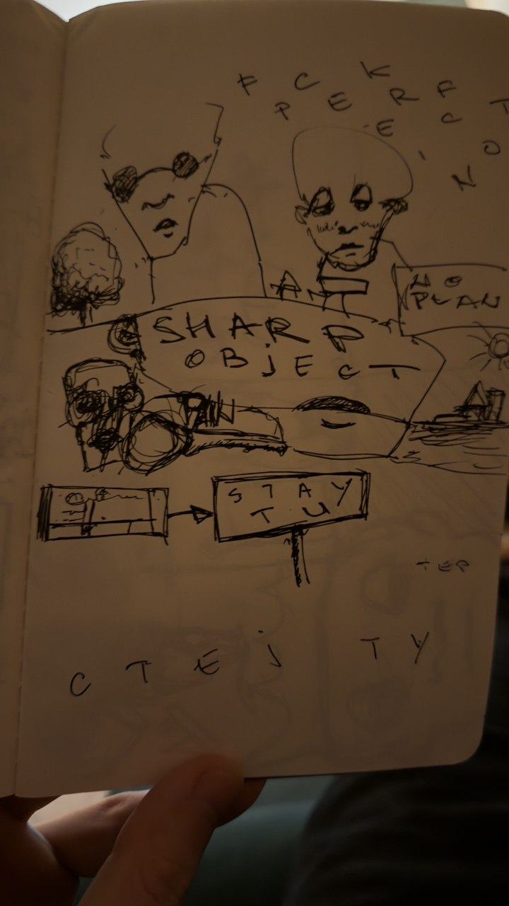
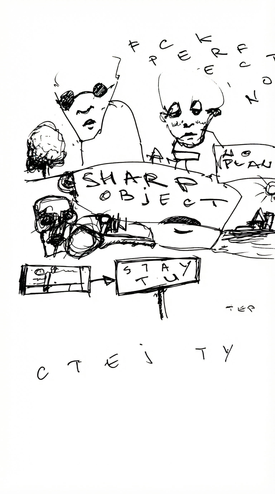
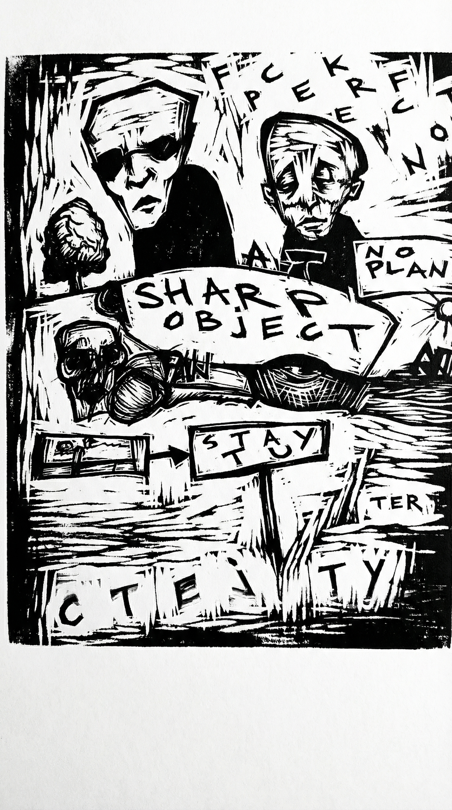
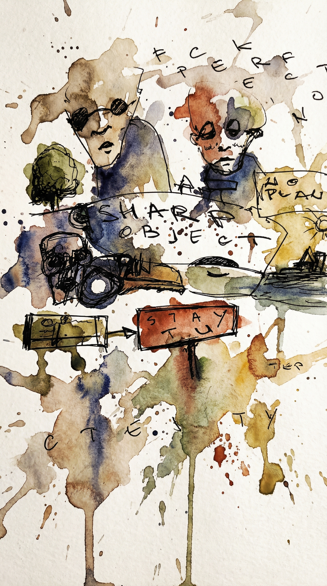
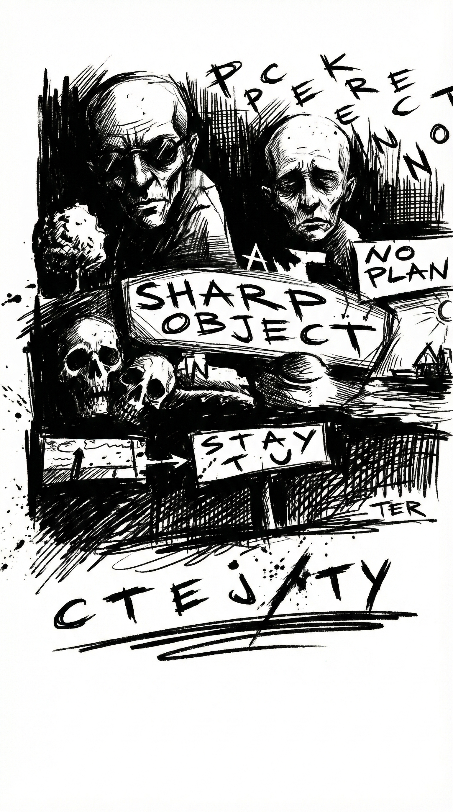
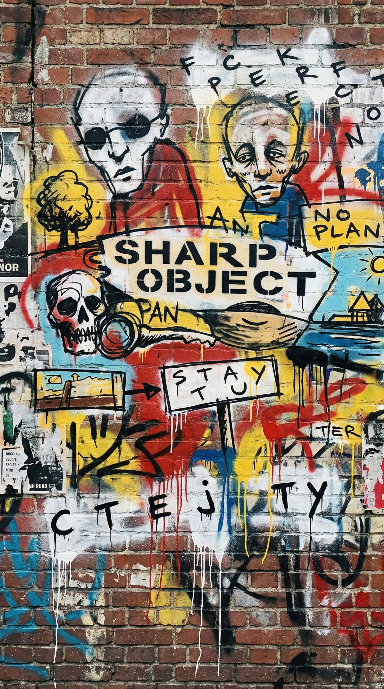
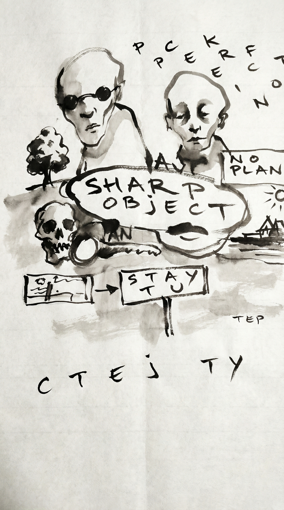

# Sketches

---

### Original

### Clean Extract

---

## Extracted Elements

### Text
- **"FCK PERFECTION"** — vertical, top of page (manifesto statement)
- **"SHARP OBJECT"** — central banner/title
- **"NO PLAN"** — right side, with sun doodle
- **"STAY TU..."** — flow diagram element (Stay Tuned? Stay True?)
- **"СТЕЈ ТУ"** — bottom, Serbian: "Stay here"

### Visual Elements
- Multiple face sketches — expressive, hollow-eyed figures around what appears to be a table/workspace
- Flow diagram with boxes and arrows
- Sun symbol near "NO PLAN"
- Raw, unpolished line work — intentionally sketchy

---

## Themes & Interpretation

**Anti-perfectionism as creative liberation**
The "FCK PERFECTION" at the top sets permission for everything below. The sketchy quality isn't accident — it's the point.

**Sharp Objects**
Could reference the HBO show, or a metaphor for dangerous/cutting ideas. The faces around the table have an intensity to them.

**Grounding / Presence**
"Stay here" (СТЕЈ ТУ) at the bottom anchors the piece. Amidst the chaos of ideas and faces — stay present.

**No Plan as Plan**
The sun next to "NO PLAN" suggests this isn't nihilism — it's openness. Letting things emerge.

---

## Style Variations

### 🪵 Woodcut Print

**Prompt:** *Transform into bold woodcut print style. High contrast black and white, rough carved texture, expressionist feel like German woodcut artists. Keep the faces, text, and composition.*

### 🎨 Watercolor

**Prompt:** *Transform into loose watercolor illustration. Expressive ink lines with muted watercolor washes bleeding outside the lines. Raw, emotional, art journal aesthetic.*

### 🖤 Noir Graphic Novel

**Prompt:** *Transform into dark graphic novel style. Heavy shadows, noir atmosphere, dramatic contrast. Think Frank Miller Sin City meets underground comics. Keep the raw energy.*

### 🏙️ Street Art

**Prompt:** *Transform into street art style. Bold colors, spray paint texture, stencil aesthetic, urban grit. Banksy meets Basquiat energy. Anti-establishment vibe.*

### 🖌️ Sumi-e Ink Wash

**Prompt:** *Transform into Japanese ink wash (sumi-e) style. Flowing brushstrokes, zen aesthetic, balance of empty space and bold marks. Contemplative, wabi-sabi imperfection.*

---

## Connections

- [[Anti-perfectionism]]
- [[Visual thinking]]
- [[Creative process]]

---

## My Notes

*Add your own thoughts, context, or what prompted this sketch...*

