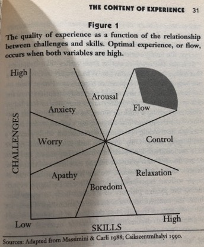

Mihaly Csikszentmihalyi is the author of [[1990 - Flow]] (not included in Ideaverse Lite). Flow remains one of the most influential books on my thinking.

## Extra

### Wiki

Mihaly Csikszentmihalyi is a Hungarian-American psychologist. He recognized and named the psychological concept of [[Flow]], a highly focused mental state conducive to productivity. He is the Distinguished Professor of Psychology and Management at Claremont Graduate University.

> Mihaly Csikszentmihalyi (29 September 1934 – 20 October 2021) was a Hungarian-American psychologist. He recognized and named the psychological concept of flow, a highly focused mental state conducive to productivity.
>
> [Wikipedia](https://en.wikipedia.org/wiki/Mihaly%20Csikszentmihalyi)